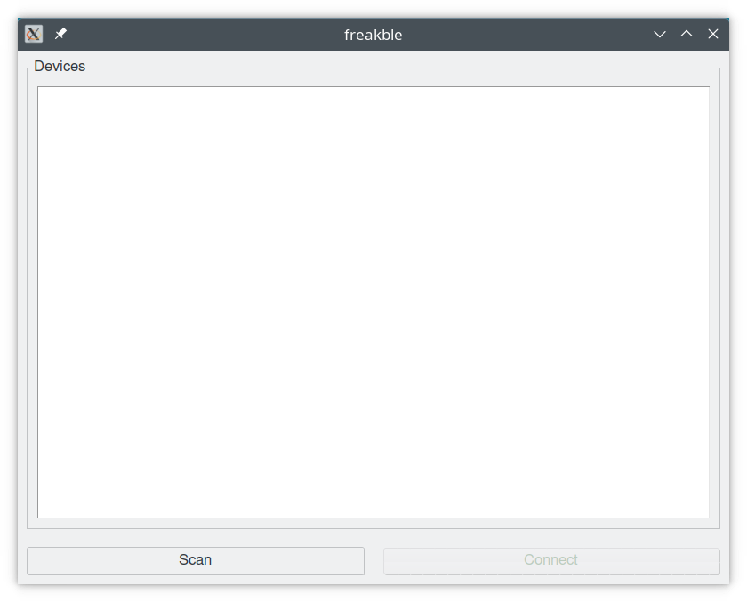
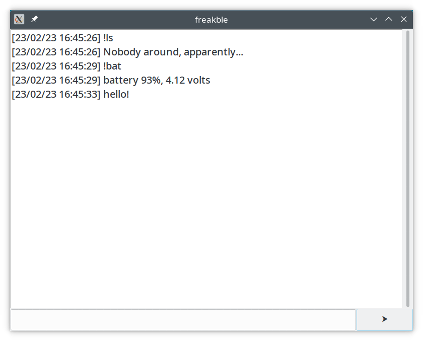

# freakble

A simple tool to send messages and commands into [FreakWAN](https://github.com/antirez/freakwan)
over Bluetooth low energy.
It's tested under Linux and Windows but it should work also on MacOS.

## Installation

### Using pipx

The best way to install freakble is using [pipx](https://pypa.github.io/pipx/):
```console
$ pipx install freakble
```

For the GUI you can optionally install themes using:
```console
$ pipx install 'freakble[themes]'
```

### Using pip

*When using pip it's suggested to work inside a virtualenv.*

```console
$ python -m pip install freakble
```

### From source

freakble uses [Poetry](https://python-poetry.org) as dependency management and
packaging tool, you need to install it first.

Then:

1. Clone this repository.
2. From the root of the repository run:
   ```console
   $ poetry build
   ```
3. Install using pipx or pip (it's better to use pipx):
   ```console
   $ pipx install dist/freakble-0.1.0-py3-none-any.whl
   ```

## Usage

```console
Usage: freakble [OPTIONS] COMMAND [ARGS]...

  A simple tool to send messages into FreakWAN.

Options:
  --adapter TEXT  ble adapter  [default: (hci0)]
  --help          Show this message and exit.

Commands:
  gui      Start freakble GUI.
  repl     Start a REPL with the device.
  scan     Scan to find BLE devices.
  send     Send one or more words over BLE to a specific device.
  version  Return freakble version.
```

### send

The `send` command is used to send a message to the board. You need to know the
address of the device.
You can specify the address of a device using the `--device` flag or the
environment variable `FREAKBLE_DEVICE`.

The complete usage is:
```console
Usage: freakble send [OPTIONS] [WORDS]...

  Send one or more words over BLE to a specific device.

Options:
  --loop              send forever the message
  --device TEXT       ble device address  [required]
  --sleep-time FLOAT  sleep between messages sent with --loop  [default: (1
                      sec)]
  --timeout FLOAT     Bluetooth LE connection timeout  [default: (10 secs)]
  --help              Show this message and exit.
```

For example:

```console
$ freakble send --device AA:AA:AA:AA:AA:AA Hello, there!
```

where you have to substitute `AA:AA:AA:AA:AA:AA` with your device's address.

The `--loop` flag will make freakble to send continuosly the message until
`CTRL + C` is pressed. The resend interval is defaults to 1 sec and can be
changed using `--sleep-time`.

```console
$ freakble send --device AA:AA:AA:AA:AA:AA --loop FREAKNET
```


You can use `FREAKBLE_DEVICE` environment variables to set the device address,
and to not have to provide it in each commands that need a device address.

For example, using `send`, if one of your device is called `FW_vuzasu`
you can do:

```console
$ export FREAKBLE_DEVICE=$(freakble scan | grep FW_vuzasu | cut -d' ' -f1)
$ freakble send "La violenza è l'ultimo rifugio degli incapaci. - Isaac Asimov"
```

FreakWAN supports commands starting with `!` character (see the list on
FreakWAN README):

```console
$ freakble send '!bat'
battery 99%, 4.20 volts
```

If you don't know what to say, you can always tempt the fates! :)
```console
freakble send "$(fortune)"
```

### scan

The `scan` command is used to discover Bluetooth LE devices.

```console
Usage: freakble scan [OPTIONS]

  Scan to find BLE devices.

Options:
  --scan-time FLOAT  scan duration  [default: (5 secs)]
  --help             Show this message and exit.
```

For example:
```
$ freakble scan
AB:AB:AB:AB:AB:AB (rssi:-52) FW_timatu
AF:AF:AF:AF:AF:AF (rssi:-57) FW_vuzasu
```

### repl

The `repl` command connects to the specified device and stats an interactive
shell with it.
The complete usage is:
```
Usage: freakble repl [OPTIONS]

  Start a REPL with the device.

Options:
  --device TEXT    ble device address  [required]
  --timeout FLOAT  Bluetooth LE connection timeout  [default: (10 secs)]
  --help           Show this message and exit.
```

For example:

```console
$ export FREAKBLE_DEVICE=$(freakble scan | grep FW | cut -d' ' -f1)
freakble 0.3.0a0 on linux
Connecting to AB:AB:AB:AB:AB:AB...
Φ]
```

`Φ]` is the freakble prompt.

You can then talk to the device remembering that commands start with `!` and
the text you write if it's not a command is sent as a message in the network.

For example, the following text is sent as a message in the network:
```
Φ] Hello there!
Φ]
```

Instead commands make you able to get info or configure your FreakWAN node:
```
Φ] !help
Commands: !automsg !pw !sp !cr !bw !freq !preset !ls !font !last !addkey !delkey !keys !usekey !nokey
Φ] !bat
battery volts: 4.2
```

Pressing `TAB` key or `!` will show the autocompletion menu.

To exit from the interactive shell use `CTRL + D` or `CTRL + C`

### gui

The `gui` command starts a GUI of freakble. If you don't set the device address
it will start with the following scan interface:



after choosing a device you can click to the connect button to get a graphical
REPL:




## License

freakble is licensed under BSD-3-Clause license.
